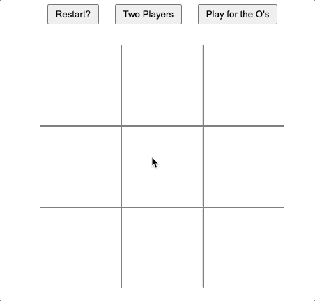
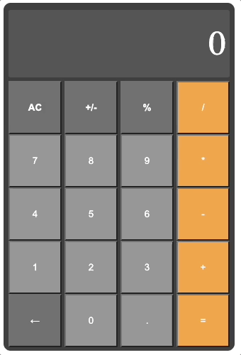

# Games & Widgets
# Tic-Tac-Toe
**Live version here**: https://jmart2210.github.io/top-tic-tac-toe/ 
A classic tic-tac-toe game built with modularity, separation of concerns, and event-driven programming in mind.  
The interface has been designed with responsive design principles and supports both desktop and mobile devices. 
The code includes a gamePlayModule that handles the game logic, including player turns, checking for win conditions, and updating the game board. The module uses an object-oriented approach and encapsulation to manage game state and track player information. 
**Optimizations**: I made the cpu move selection to first return if there is a winning move, second if your opponent has a "losing" move so you can block it, and lastly the next best moved based on how useful it appears to be. It determines usefulness by brute force, comparing how many times a given move shows up in the remaining winning combos. Currently the cpu is unbeatable. I think it would be fun to implement another difficulty setting where the cpu selection has a chance to be randomized when there is no obvious move (nothing that wins or loses the game). This would allow potential blunders that the user may be able to take advantage of. 

# Calculator
A fully functional calculator built with HTML, CSS, and Javascript, supporting both mouse and key-stroke input. The basic functionality was fairly simple. The trickiest parts were the details of the edge cases.  
For example: when someone completes an operation, let's say 5+3. They might hit the equals key to display the result (8), or they might continue their operation, hitting the plus key and the next number to make 5+3+2. The specs of the project were to only allow one operation at a time, so we couldn't just keep a record of all operations and compute at the end, it needed to compute at every step.  
The tricky part was they could also hit the equals key to get the result. The user inputs 5+3+2=(10) They may want to continue operating from the (10), hitting one of the operation buttons next. Or they may want to move on to another problem. They could always hit the clear button, but I wanted it to be intuitive, and it's very likely they would expect that just hitting the next number would start the next operation.  
I resolved this by storing a temporary result, the next operand, and a boolean variable "first". I then implemented some conditional logic with those variables to make the program function intuitively. I heavily commented the code to explain my thought process at each step. 
**Live version here**: https://jmart2210.github.io/calculator/  
